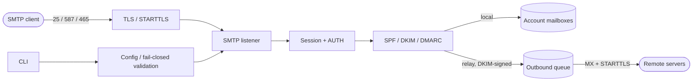

# mail

Self-hosted, headless mail server — SMTP, IMAP and modern email security through an API and CLI. Part of the Glyndor stack.

[](https://github.com/Glyndor/mail/actions/workflows/ci.yml)

> 🚧 Early development. The SMTP core works; most of the roadmap is still ahead.



## ✨ What works today

- 📨 **SMTP server core** — strict RFC 5321 session handling: HELO/EHLO, MAIL FROM (with `SIZE`/`BODY`), RCPT TO, DATA, RSET, NOOP, QUIT
- 🔐 **TLS everywhere** — STARTTLS (RFC 3207) on SMTP/submission, implicit TLS for `submissions`; rustls, no OpenSSL; broken TLS material refuses to start instead of degrading
- 🛡️ **Smuggling-immune by construction** — bare CR, bare LF or NUL anywhere in the stream closes the connection; CRLF is enforced at the framing layer
- 🚫 **No relay, no ghosts** — recipients outside the configured `domains` answer `550 5.7.1`, unknown users in local domains answer `550 5.1.1`; with nothing configured everything is denied (fail closed)
- ✅ **Full authentication chain** — SPF (RFC 7208) with `fail` rejection, DKIM verification (RFC 6376, rsa + ed25519), DMARC alignment and policy enforcement (RFC 7489); results recorded in `Authentication-Results`
- ✍️ **DKIM signing** — outbound mail signed with ed25519; `mail dkim-keygen` generates the key and prints the DNS record
- 🔑 **Submission with AUTH** — `AUTH PLAIN` over TLS only, argon2id password hashes, no user-enumeration oracle; authenticated users relay from their own addresses
- 📤 **Outbound queue** — MX resolution, opportunistic STARTTLS, per-domain delivery with retry/backoff semantics
- 📬 **Local delivery** — accepted mail lands once per recipient account under `data_dir/accounts/<name>/new/`
- 🔒 **Secure by default** — listeners bind to localhost unless explicitly configured otherwise; configuration fails closed on any unknown key or invalid value
- 💾 **Crash-safe writes** — accepted messages are fsynced and atomically renamed into the mailbox before the server answers `250`
- 🧰 **Operator CLI** — `mail serve`, `mail config-check`, `mail dkim-keygen`, meaningful exit codes

## Install

```sh
curl -fsSL https://glyndor.net/install/mail | sh
```

Installs the latest release binary to `/usr/local/bin`. Override with `INSTALL_DIR=/path/to/bin`.

## 🚀 Quick start (from source)

```sh
cargo build --release

cat > mail.toml <<'EOF'
hostname = "mail.example.org"
data_dir = "/var/lib/mail"
domains = ["example.org"]

[[accounts]]
name = "alice"
addresses = ["alice@example.org", "postmaster@example.org"]

[[listeners]]
kind = "smtp"
EOF

./target/release/mail config-check --config mail.toml
./target/release/mail serve --config mail.toml
```

The SMTP listener binds to `127.0.0.1:25` by default — exposing it is an explicit decision:

```toml
[[listeners]]
kind = "smtp"
addr = "0.0.0.0"
```

## 🗺️ Roadmap

Mailbox model (flags/quotas), DSN bounces, MTA-STS/DANE, IMAP4rev2 and the management API are tracked in the [issues](https://github.com/Glyndor/mail/issues).

## 📄 License

[Apache-2.0](LICENSE)
